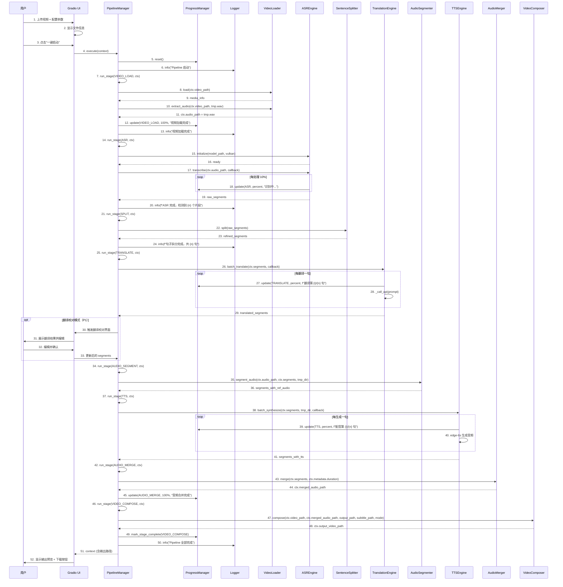
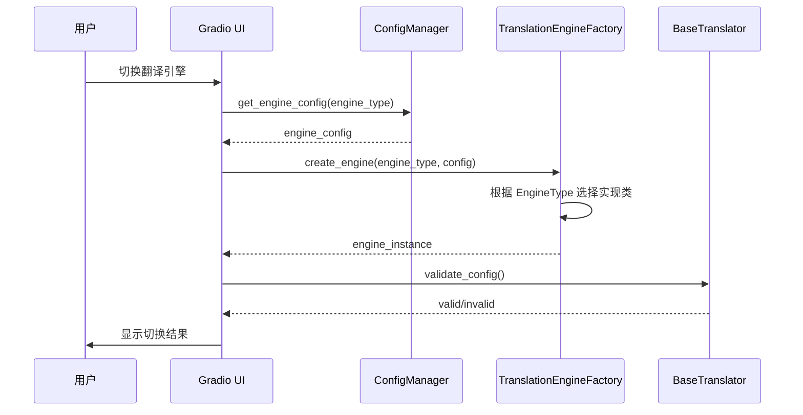
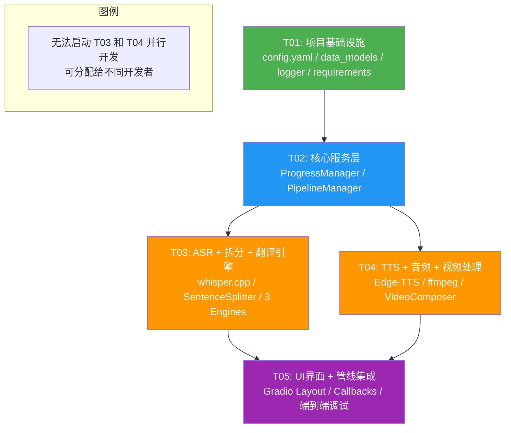

# VideoDub 系统架构设计文档

> **版本**: v1.0  
> **编制人**: Bob (Architect)  
> **日期**: 2026-06-13  
> **基于 PRD**: v1.0 by Alice (Product Manager)

---

## Part A: 系统设计

---

### 1. 实现方案与框架选型

#### 1.1 整体技术栈

| 层级 | 技术选型 | 版本 | 选型理由 |
|------|----------|------|----------|
| **运行时环境** | Python | 3.11+ | 生态成熟，Gradio/whisper/ffmpeg 绑定齐全 |
| **Web 界面** | Gradio | 5.x | 快速构建带进度反馈的 Web UI，内置组件丰富 |
| **ASR 引擎** | whisper.cpp (Vulkan) | latest | 支持 AMD 9070XT Vulkan 后端，纯本地推理，性能优异 |
| **翻译引擎** | OpenAI-compatible API | — | SiliconFlow / LM Studio / DeepSeek 均兼容同一协议 |
| **TTS 引擎** | edge-tts | latest | 免费、高质量、支持中文普通话和英文 |
| **视频/音频处理** | ffmpeg (via ffmpeg-python) | latest | 最全面的音视频编解码方案 |
| **配置管理** | pyyaml | 6.x | YAML 格式简洁可读 |
| **异步支持** | asyncio + threading | stdlib | Gradio 异步回调 + 后台线程执行 Pipeline |

#### 1.2 核心技术挑战与应对方案

| 挑战 | 方案 |
|------|------|
| **AMD 9070XT GPU 加速** | whisper.cpp 编译启用 `-DGGML_VULKAN=ON`，通过 Vulkan 后端调用 AMD GPU |
| **多翻译引擎热切换** | 抽象基类 `BaseTranslator` + 工厂模式，运行时通过配置动态切换实现 |
| **实时进度反馈** | `ProgressManager` 作为观察者，各模块通过回调上报进度，Gradio 轮询或 Event 驱动 |
| **音画同步** | 所有时间戳以 ASR 输出为基准，TTS 生成后以原始时间戳对齐，最终 ffmpeg 精确合成 |
| **长视频分片** | 自动检测视频时长，超过 30 分钟自动按音频静音点分段处理 |

#### 1.3 架构模式

采用 **Pipeline 管线架构** + **策略模式（翻译引擎）** + **观察者模式（进度通知）**：

```
用户操作 → Gradio UI → PipelineManager (调度器)
                          ├── Stage 1: VideoLoader
                          ├── Stage 2: ASREngine
                          ├── Stage 3: SentenceSplitter
                          ├── Stage 4: TranslationEngine (策略切换)
                          ├── Stage 5: AudioSegmenter
                          ├── Stage 6: TTSEngine
                          ├── Stage 7: AudioMerger
                          └── Stage 8: VideoComposer
                          └── 贯穿: ProgressManager (观察者) + Logger
```

#### 1.4 模块间通信机制（统一数据契约）

所有模块使用 `PipelineContext` 作为唯一数据载体。每个模块从 `PipelineContext` 读取所需数据，处理后写回。模块间无直接耦合。

```python
# 核心数据流
PipelineContext {
    .video_path          # str: 原始视频路径
    .audio_path          # str: 提取的音频路径
    .segments            # List[Segment]: 贯穿全流程的核心分段数据
    .merged_audio_path   # str: 合并后的配音音频路径
    .output_video_path   # str: 最终输出视频路径
    .metadata            # dict: 视频元信息
    .config              # dict: 运行时配置快照
}
```

---

### 2. 文件列表

```
video_dub/
│
├── app.py                          # Gradio 应用主入口，启动 Web 服务
├── config.yaml                     # 全局配置文件（YAML 格式）
├── requirements.txt                # Python 依赖声明
│
├── src/
│   ├── __init__.py
│   │
│   ├── core/
│   │   ├── __init__.py
│   │   ├── data_models.py          # PipelineContext, Segment, 枚举类型定义
│   │   ├── config_manager.py       # 配置读取/写入/校验
│   │   ├── logger.py               # 分级日志系统（INFO/WARNING/ERROR）
│   │   ├── progress_manager.py     # 进度管理器（观察者模式）
│   │   └── pipeline_manager.py     # 管线调度器（编排各阶段执行顺序）
│   │
│   ├── video/
│   │   ├── __init__.py
│   │   ├── video_loader.py         # 视频加载器：格式校验、元信息提取、音频流分离
│   │   ├── audio_merger.py         # 音频合并器：分段 TTS 音频按时间轴拼接
│   │   └── video_composer.py       # 视频合成器：原视频 + 新音轨 + 可选字幕
│   │
│   ├── asr/
│   │   ├── __init__.py
│   │   └── asr_engine.py           # whisper.cpp Vulkan 后端语音识别
│   │
│   ├── splitter/
│   │   ├── __init__.py
│   │   └── sentence_splitter.py    # 智能句子拆分（语义边界+时间戳保持）
│   │
│   ├── translator/
│   │   ├── __init__.py
│   │   ├── base_engine.py          # 翻译引擎抽象基类（统一接口契约）
│   │   ├── siliconflow_engine.py   # SiliconFlow API 实现
│   │   ├── lmstudio_engine.py      # LM Studio 本地模型实现
│   │   ├── deepseek_engine.py      # DeepSeek API 实现
│   │   └── translation_engine.py   # 翻译引擎工厂（动态切换 + 创建）
│   │
│   ├── tts/
│   │   ├── __init__.py
│   │   └── tts_engine.py           # Edge-TTS 配音引擎
│   │
│   ├── audio/
│   │   ├── __init__.py
│   │   └── audio_segmenter.py      # 音频分段器（按时间戳切分原始音频参考）
│   │
│   └── ui/
│       ├── __init__.py
│       ├── app_layout.py           # Gradio 界面布局定义
│       ├── components.py           # 可复用 UI 组件（进度面板、日志面板等）
│       └── callbacks.py            # Gradio 事件回调绑定
│
├── outputs/                        # 输出文件目录
├── logs/                           # 日志文件目录
│
├── models/                         # whisper.cpp 模型文件目录
│   └── ggml-large-v3.bin          # ASR 模型文件（用户自行下载）
│
└── scripts/
    └── download_model.sh           # 模型下载辅助脚本
```

**文件总数**: 28 个文件（含 `__init__.py`）

---

### 3. 数据结构与接口（类图）

```mermaid
classDiagram
    %% ========== 枚举 ==========
    class PipelineStage {
        <<enumeration>>
        VIDEO_LOAD
        ASR
        SENTENCE_SPLIT
        TRANSLATE
        AUDIO_SEGMENT
        TTS
        AUDIO_MERGE
        VIDEO_COMPOSE
    }

    class PipelineStatus {
        <<enumeration>>
        PENDING
        RUNNING
        COMPLETED
        FAILED
        CANCELLED
    }

    class SegmentStatus {
        <<enumeration>>
        PENDING
        TRANSLATED
        TTS_DONE
        COMPLETED
    }

    class EngineType {
        <<enumeration>>
        SILICONFLOW
        LM_STUDIO
        DEEPSEEK
    }

    %% ========== 数据模型 ==========
    class Segment {
        +int index
        +str original_text
        +str translated_text
        +float start_time
        +float end_time
        +str tts_audio_path
        +SegmentStatus status
        +str error_message
        +__init__(index, original_text, start_time, end_time)
        +to_dict() dict
        +from_dict(data: dict) Segment
    }

    class PipelineContext {
        +str video_path
        +str audio_path
        +float duration
        +str source_lang
        +str target_lang
        +str output_format
        +str subtitle_mode
        +EngineType engine_type
        +PipelineStatus status
        +List~Segment~ segments
        +str merged_audio_path
        +str output_video_path
        +str subtitle_path
        +dict metadata
        +dict config_snapshot
        +str working_dir
        +__init__(video_path, config)
        +add_segment(segment)
        +get_segment(index) Segment
        +to_dict() dict
    }

    %% ========== 基础服务 ==========
    class ConfigManager {
        -dict _config
        -str _path
        +__init__(config_path: str)
        +load() dict
        +save() void
        +get(key: str, default: Any) Any
        +get_engine_config(engine_type: EngineType) dict
        +validate() List~str~
    }

    class ProgressManager {
        -dict _progress
        -callable _callback
        -datetime _stage_start
        +__init__(callback: callable)
        +update(stage: PipelineStage, percent: float, message: str)
        +get_summary() dict
        +get_stage_progress(stage: PipelineStage) dict
        +estimate_remaining() float
        +reset()
        +mark_stage_complete(stage: PipelineStage)
        +mark_stage_failed(stage: PipelineStage, error: str)
    }

    class Logger {
        -str _log_dir
        -str _log_file
        +__init__(log_dir: str)
        +info(message: str, module: str)
        +warning(message: str, module: str)
        +error(message: str, module: str, exc_info: bool)
        +get_recent(level: str, lines: int) List~dict~
        +get_file_path() str
    }

    %% ========== Pipeline 调度器 ==========
    class PipelineManager {
        -ConfigManager _config
        -ProgressManager _progress
        -Logger _logger
        -Thread _worker
        -bool _cancelled
        +__init__(config: ConfigManager, progress: ProgressManager, logger: Logger)
        +execute(context: PipelineContext) PipelineContext
        -run_stage(stage: PipelineStage, context: PipelineContext)
        -stage_video_load(ctx) void
        -stage_asr(ctx) void
        -stage_split(ctx) void
        -stage_translate(ctx) void
        -stage_audio_segment(ctx) void
        -stage_tts(ctx) void
        -stage_audio_merge(ctx) void
        -stage_video_compose(ctx) void
        +cancel() void
        +get_status() dict
    }

    %% ========== 视频模块 ==========
    class VideoLoader {
        +SUPPORTED_FORMATS: List~str~
        +load(video_path: str) dict
        +extract_audio(video_path: str, output_path: str) str
        +get_media_info(video_path: str) dict
        +validate_format(video_path: str) bool
    }

    class AudioMerger {
        +merge(segments: List~Segment~, output_path: str) str
        +normalize_audio(audio_path: str) str
    }

    class VideoComposer {
        +compose(video_path: str, audio_path: str, output_path: str, subtitle_path: str, subtitle_mode: str) str
        +add_subtitle_track(video_path: str, subtitle_path: str, output_path: str) str
        +burn_subtitles(video_path: str, subtitle_path: str, output_path: str) str
    }

    %% ========== ASR 模块 ==========
    class ASREngine {
        -str _model_path
        -str _backend
        -int _gpu_device
        -subprocess _process
        +__init__(model_path: str, backend: str, gpu_device: int)
        +initialize() bool
        +transcribe(audio_path: str, progress_callback: callable) List~Segment~
        +shutdown() void
        -build_whisper_command(audio_path: str, output_path: str) List~str~
        -parse_output(output_path: str) List~dict~
    }

    %% ========== 句子拆分 ==========
    class SentenceSplitter {
        +int max_segment_duration
        +split(segments: List~Segment~) List~Segment~
        +merge_short_segments(segments: List~Segment~, min_duration: float) List~Segment~
        +split_long_segment(segment: Segment, max_duration: float) List~Segment~
    }

    %% ========== 翻译引擎 ==========
    class BaseTranslator {
        <<abstract>>
        #str _api_url
        #str _model_name
        #str _api_key
        #dict _params
        +__init__(config: dict)
        +translate(segment: Segment, source_lang: str, target_lang: str) Segment*
        +batch_translate(segments: List~Segment~, source_lang: str, target_lang: str, progress_callback: callable) List~Segment~*
        #_call_api(messages: List~dict~) str*
        +validate_config() bool*
    }

    class SiliconFlowEngine {
        +__init__(config: dict)
        +translate(segment, source_lang, target_lang) Segment
        +batch_translate(segments, source_lang, target_lang, progress_callback) List~Segment~
        #_call_api(messages) str
        +validate_config() bool
    }

    class LMStudioEngine {
        +__init__(config: dict)
        +translate(segment, source_lang, target_lang) Segment
        +batch_translate(segments, source_lang, target_lang, progress_callback) List~Segment~
        #_call_api(messages) str
        +validate_config() bool
    }

    class DeepSeekEngine {
        +__init__(config: dict)
        +translate(segment, source_lang, target_lang) Segment
        +batch_translate(segments, source_lang, target_lang, progress_callback) List~Segment~
        #_call_api(messages) str
        +validate_config() bool
    }

    class TranslationEngineFactory {
        +create_engine(engine_type: EngineType, config: dict) BaseTranslator
        +list_available_engines() List~EngineType~
    }

    %% ========== TTS 模块 ==========
    class TTSEngine {
        -str _voice
        -str _rate
        -int _connect_timeout
        +__init__(voice: str, rate: str)
        +synthesize(segment: Segment, output_dir: str) str
        +batch_synthesize(segments: List~Segment~, output_dir: str, progress_callback: callable) List~Segment~
        +validate_voice(voice: str) bool
        +list_voices() List~str~
    }

    %% ========== 音频分段 ==========
    class AudioSegmenter {
        +segment_audio(audio_path: str, segments: List~Segment~, output_dir: str) List~Segment~
        +extract_chunk(audio_path: str, start: float, end: float, output_path: str) str
    }

    %% ========== 关系 ==========
    PipelineContext "1" --> "*" Segment : contains
    PipelineManager --> PipelineContext : orchestrates
    PipelineManager --> ProgressManager : reports to
    PipelineManager --> Logger : logs to
    PipelineManager --> VideoLoader : uses
    PipelineManager --> ASREngine : uses
    PipelineManager --> SentenceSplitter : uses
    PipelineManager --> TranslationEngineFactory : uses
    PipelineManager --> AudioSegmenter : uses
    PipelineManager --> TTSEngine : uses
    PipelineManager --> AudioMerger : uses
    PipelineManager --> VideoComposer : uses

    TranslationEngineFactory --> BaseTranslator : creates
    BaseTranslator <|-- SiliconFlowEngine
    BaseTranslator <|-- LMStudioEngine
    BaseTranslator <|-- DeepSeekEngine

    PipelineStage --> PipelineManager : stage enum
    PipelineStatus --> PipelineContext : status enum
    SegmentStatus --> Segment : status enum
    EngineType --> TranslationEngineFactory : type enum
```



---

### 4. 程序调用流程（时序图）

#### 4.1 完整 Pipeline 时序



#### 4.2 翻译引擎动态切换流程



---

### 5. 待明确事项

| 编号 | 问题 | 建议方案 | 需决策内容 |
|------|------|----------|-----------|
| U1 | **whisper.cpp 模型大小选择**：small / medium / large-v3 对 AMD 9070XT 显存（16GB）的适配性 | 建议默认使用 `large-v3`（显存占用 ~10GB），提供 small/medium 作为备用选项 | 确认默认模型及显存释放策略 |
| U2 | **翻译文本编辑触发时机**：翻译完成后统一编辑 vs 逐句实时编辑 | 按 PRD 建议：全部翻译完成后统一进入编辑模式 | 确认是否在 MVP 中实现 P1-3 翻译编辑功能 |
| U3 | **并发处理策略**：单视频串行 vs 多视频并行 | MVP 阶段建议串行处理以降低显存争抢，批量队列（P2-2）后延 | 确认 MVP 阶段仅支持单视频串行 |
| U4 | **输出容器格式优先级**：MP4 或 MKV 作为默认输出 | 建议 MVP 默认输出 MP4(H.264+AAC)，MKV 作为备选 | 确认默认输出格式 |
| U5 | **工作目录清理策略**：临时文件的清理时机 | 建议每次任务完成后清理 `working_dir`，仅保留最终输出 | 确认清理策略 |
| U6 | **whisper.cpp 模型下载集成**：是否在 UI 中提供一键下载 | 建议提供 `scripts/download_model.sh` 脚本 + 首次运行引导，不内置下载到 UI 中 | 确认模型获取方式 |

---

## Part B: 任务分解

---

### 6. 所需依赖包

```txt
# 核心框架
gradio>=5.0.0,<6.0.0          # Web UI 框架
pyyaml>=6.0,<7.0              # YAML 配置解析

# 音视频处理
ffmpeg-python>=0.2.0,<0.3.0   # ffmpeg Python 绑定
pydub>=0.25.1,<0.26.0         # 音频处理辅助

# TTS
edge-tts>=6.1.0,<7.0.0        # 微软 Edge TTS

# 翻译引擎（HTTP 客户端）
httpx>=0.27.0,<0.28.0         # 异步 HTTP 客户端，用于翻译 API 调用

# 工具
soundfile>=0.12.1,<0.13.0     # 音频文件读写
numpy>=1.24.0,<2.0            # 数值计算

# 开发/调试
pytest>=8.0,<9.0              # 测试框架
pytest-asyncio>=0.23.0        # 异步测试支持
```

> **注意**: `whisper.cpp` 不作为 Python 包引入，而是通过 `subprocess` 调用编译好的二进制文件。用户需自行编译或下载带 Vulkan 支持的 `whisper.cpp` 可执行文件。

---

### 7. 任务列表（按依赖顺序排序）

#### T01: 项目基础设施（P0）

| 字段 | 值 |
|------|-----|
| **任务名称** | 项目基础设施 — 配置 + 入口 + 依赖声明 |
| **源文件** | `requirements.txt`, `config.yaml`, `app.py`, `src/__init__.py`, `src/core/__init__.py`, `src/core/data_models.py`, `src/core/config_manager.py`, `src/core/logger.py`, `scripts/download_model.sh` |
| **依赖** | 无 |
| **优先级** | P0 |

**职责说明**:
- `requirements.txt` — 声明所有 Python 依赖
- `config.yaml` — 全局配置模板（含三个翻译引擎的 API 地址/模型名/参数示例、ASR 模型路径、TTS 语音设置）
- `app.py` — Gradio 应用入口（导入 UI 模块并启动）
- `src/__init__.py`, `src/core/__init__.py` — 包初始化
- `src/core/data_models.py` — 定义 `PipelineContext`, `Segment`, 枚举类 (`PipelineStage`, `PipelineStatus`, `SegmentStatus`, `EngineType`)
- `src/core/config_manager.py` — `ConfigManager` 类（YAML 加载/保存/校验/按引擎获取配置）
- `src/core/logger.py` — `Logger` 类（INFO/WARNING/ERROR 三级，文件滚动，支持前端查询）
- `scripts/download_model.sh` — whisper.cpp 模型下载脚本

---

#### T02: 核心服务 + 进度管理 + 管线调度（P0）

| 字段 | 值 |
|------|-----|
| **任务名称** | 核心服务层 — 进度管理 + 管线调度器 |
| **源文件** | `src/core/progress_manager.py`, `src/core/pipeline_manager.py`, `src/video/__init__.py`, `src/asr/__init__.py`, `src/splitter/__init__.py`, `src/translator/__init__.py`, `src/tts/__init__.py`, `src/audio/__init__.py`, `src/ui/__init__.py` |
| **依赖** | T01 |
| **优先级** | P0 |

**职责说明**:
- `src/core/progress_manager.py` — `ProgressManager` 类（阶段进度更新、百分比计算、预估剩余时间、回调通知）
- `src/core/pipeline_manager.py` — `PipelineManager` 类（编排 8 个阶段的执行顺序、异常处理、取消支持、状态查询）
- 所有模块包的 `__init__.py` — 模块初始化 + 导出符号

**注意**: 此任务仅完成调度框架和进度管理逻辑，具体模块实现在后续任务中填充。

---

#### T03: ASR + 句子拆分 + 翻译引擎模块（P0）

| 字段 | 值 |
|------|-----|
| **任务名称** | 核心处理模块 — ASR + 句子拆分 + 三引擎翻译 |
| **源文件** | `src/asr/asr_engine.py`, `src/splitter/sentence_splitter.py`, `src/translator/base_engine.py`, `src/translator/translation_engine.py`, `src/translator/siliconflow_engine.py`, `src/translator/lmstudio_engine.py`, `src/translator/deepseek_engine.py` |
| **依赖** | T02 |
| **优先级** | P0 |

**职责说明**:
- `src/asr/asr_engine.py` — 通过 subprocess 调用 whisper.cpp Vulkan 后端，解析 JSON 输出为 Segment 列表，支持进度回调
- `src/splitter/sentence_splitter.py` — 基于标点/停顿的智能分段，合并短句/拆分超长句，保持时间戳连续性
- `src/translator/base_engine.py` — `BaseTranslator` 抽象基类定义（translate, batch_translate, _call_api, validate_config）
- `src/translator/siliconflow_engine.py` — SiliconFlow API 实现（兼容 OpenAI API 格式）
- `src/translator/lmstudio_engine.py` — LM Studio 本地 API 实现
- `src/translator/deepseek_engine.py` — DeepSeek API 实现
- `src/translator/translation_engine.py` — `TranslationEngineFactory` 工厂类，根据 EngineType 创建对应引擎实例

---

#### T04: 视频处理 + 音频处理 + TTS 配音模块（P0）

| 字段 | 值 |
|------|-----|
| **任务名称** | 输出处理模块 — TTS 配音 + 音频分段/合并 + 视频合成 |
| **源文件** | `src/tts/tts_engine.py`, `src/audio/audio_segmenter.py`, `src/video/video_loader.py`, `src/video/audio_merger.py`, `src/video/video_composer.py` |
| **依赖** | T02 |
| **优先级** | P0 |

**职责说明**:
- `src/video/video_loader.py` — 格式校验、ffprobe 提取元信息、ffmpeg 分离音频流
- `src/audio/audio_segmenter.py` — 按 Segment 时间戳从原始音频中切分参考片段
- `src/tts/tts_engine.py` — 基于 edge-tts 逐句合成，支持中英文语音选择，返回音频文件路径
- `src/video/audio_merger.py` — 将分段 TTS 音频按时间轴拼接为完整音轨（ffmpeg concat）
- `src/video/video_composer.py` — 原视频流 + 新配音轨 + 可选字幕（软字幕/硬字幕）合成最终输出

**并行提示**: T03 和 T04 可**并行开发**，两者仅依赖 T02（无相互依赖）。

---

#### T05: Gradio UI 界面 + 管线集成 + 最终调试（P0）

| 字段 | 值 |
|------|-----|
| **任务名称** | UI 界面 + 管线集成 + 端到端调试 |
| **源文件** | `src/ui/app_layout.py`, `src/ui/components.py`, `src/ui/callbacks.py`, `app.py`（更新） |
| **依赖** | T03, T04 |
| **优先级** | P0 |

**职责说明**:
- `src/ui/app_layout.py` — Gradio Blocks 布局定义（左侧输入面板 + 右侧进度日志面板 + 底部输出区域）
- `src/ui/components.py` — 可复用 UI 组件（进度条、日志展示区、翻译编辑弹窗、引擎配置面板）
- `src/ui/callbacks.py` — 事件回调绑定（文件上传 → 显示信息、引擎切换 → 更新配置、一键启动 → 调用 PipelineManager、进度轮询更新）
- `app.py`（更新） — 创建 Gradio 应用实例，组装 UI 布局 + 回调，启动服务

---

### 8. 任务依赖关系图



> **并行策略**: T03 和 T04 无相互依赖，均可从 T02 完成后开始并行开发。T05 需等待 T03 和 T04 全部完成后开始集成。

---

### 9. 共享知识（跨模块约定）

#### 9.1 文件路径约定

| 路径类型 | 约定 | 示例 |
|----------|------|------|
| 临时工作目录 | `outputs/{task_id}/` | `outputs/20260613_143000/` |
| 提取的音频 | `{work_dir}/audio_raw.wav` | |
| 分段音频目录 | `{work_dir}/segments/` | |
| TTS 输出 | `{work_dir}/tts/seg_{index:04d}.wav` | `tts/seg_0012.wav` |
| 合并音频 | `{work_dir}/audio_dub.wav` | |
| 最终输出 | `{work_dir}/output_{basename}_dubbed.mp4` | |
| 日志文件 | `logs/videodub_{YYYYMMDD}.log` | `logs/videodub_20260613.log` |
| whisper 模型 | `models/ggml-large-v3.bin` | |

#### 9.2 编码约定

- **类型注解**: 所有函数参数和返回值必须添加 Python 类型注解（`typing` 模块）
- **文档字符串**: 所有公共类和方法必须包含 Google 风格的 docstring
- **命名规范**: `snake_case` 变量和函数，`PascalCase` 类名，`UPPER_CASE` 常量
- **异常处理**: 各模块只抛出 `VideoDubError` 及其子类，不抛出裸 `Exception`
- **异步**: 翻译引擎 API 调用使用 `httpx.AsyncClient`，其他模块保持同步

#### 9.3 日志格式约定

```
[YYYY-MM-DD HH:MM:SS.mmm] [LEVEL] [ModuleName] 消息内容
```

示例:
```
[2026-06-13 14:30:01.234] [INFO] [ASREngine] whisper.cpp 模型加载完成，使用 Vulkan 后端
[2026-06-13 14:30:02.456] [WARNING] [SentenceSplitter] 第 8 句时长 15.2s 超过阈值，自动拆分
[2026-06-13 14:30:05.678] [ERROR] [TranslationEngine] DeepSeek API 请求超时 (30s)
```

日志文件编码: UTF-8，按日期滚动，保留最近 30 天。

#### 9.4 错误处理约定

```python
class VideoDubError(Exception):
    """所有 VideoDub 异常的基类"""
    pass

class ASRError(VideoDubError):
    """ASR 模块异常"""
    pass

class TranslationError(VideoDubError):
    """翻译模块异常（含 API 错误、超时、无效响应）"""
    pass

class TTSError(VideoDubError):
    """TTS 模块异常"""
    pass

class VideoProcessingError(VideoDubError):
    """视频/音频处理异常（ffmpeg 调用失败）"""
    pass
```

- 所有 ffmpeg 调用必须检查返回码，非零时抛出 `VideoProcessingError`
- 翻译模块 API 调用需实现重试策略：首次失败等待 3 秒重试，最多 3 次
- PipelineManager 捕获所有异常，记录 ERROR 日志，标记对应阶段为 FAILED，**不会中断**已完成阶段的结果

#### 9.5 进度回调约定

进度回调函数签名:
```python
def progress_callback(stage: PipelineStage, percent: float, message: str) -> None:
    """
    Args:
        stage: 当前执行阶段
        percent: 0.0 ~ 100.0
        message: 人类可读的状态描述
    """
```

各模块在关键节点调用 `progress_callback`，更新频率 ≥ 每 2 秒一次。

#### 9.6 翻译引擎 API 统一格式

所有三个翻译引擎均兼容 OpenAI Chat Completions API 格式：

```json
// 请求
{
    "model": "模型名称",
    "messages": [
        {"role": "system", "content": "Translate the following text from {source_lang} to {target_lang}. Only output the translation, no explanations."},
        {"role": "user", "content": "{原文文本}"}
    ],
    "temperature": 0.3,
    "max_tokens": 1024
}

// 响应（标准 OpenAI 格式）
{
    "choices": [
        {
            "message": {
                "content": "翻译后的文本"
            }
        }
    ]
}
```

---

### 附录：快速索引

| 任务 ID | 名称 | 文件数 | 依赖 | 并行可能性 |
|---------|------|--------|------|-----------|
| T01 | 项目基础设施 | 9 | 无 | — |
| T02 | 核心服务层 | 9（含 `__init__.py`） | T01 | — |
| T03 | ASR + 拆分 + 翻译 | 7 | T02 | 可和 T04 并行 |
| T04 | TTS + 音频 + 视频 | 5 | T02 | 可和 T03 并行 |
| T05 | UI + 集成 | 4 | T03, T04 | 需等待 T03+T04 |

**总文件**: 28 个 | **总任务**: 5 个 | **MVP 范围**: P0 全部覆盖
