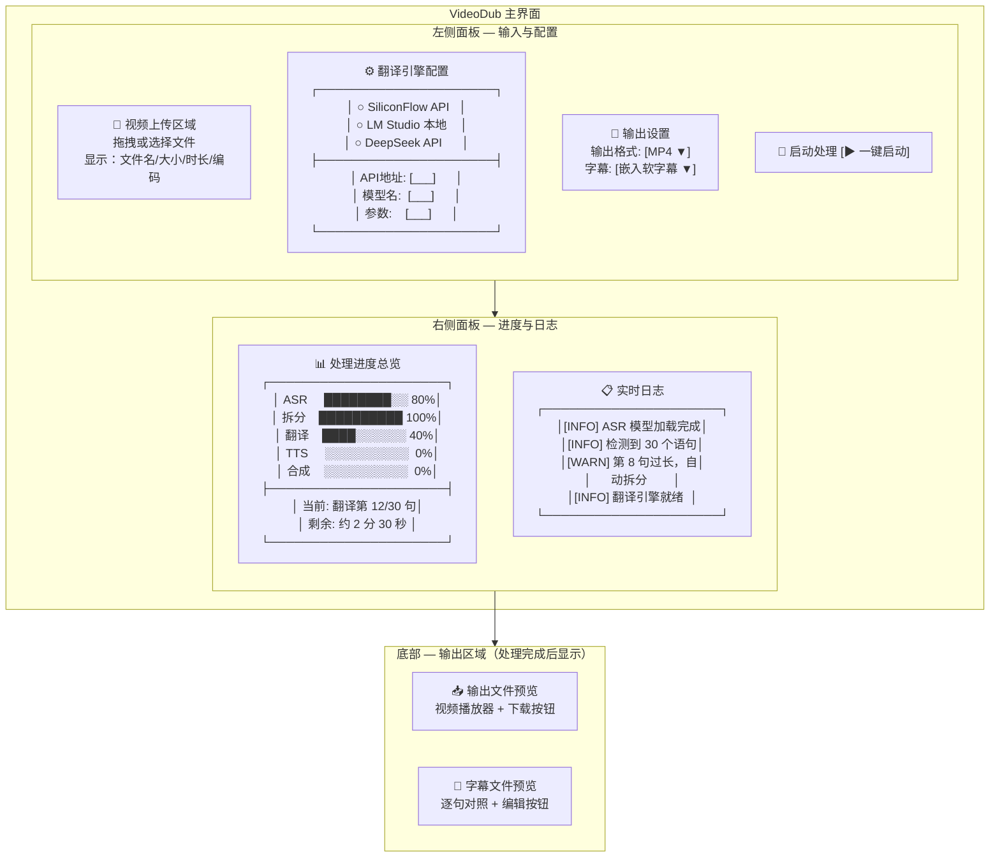
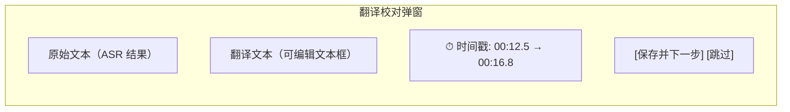

# VideoDub — 本地视频翻译配音软件 · PRD

## 1. 项目信息

| 字段 | 值 |
|------|-----|
| **项目名称** | video_dub |
| **语言** | Python + Gradio |
| **目标框架** | Gradio Web UI + 模块化 Pipeline 架构 |
| **原始需求** | 从零构建完整的本地化视频翻译配音桌面工具，支持上传本地视频 → ASR 语音识别（whisper.cpp + AMD 9070XT 加速） → 智能句子拆分 → 多引擎翻译 → 音频分段 → Edge-TTS 配音 → 音频合并 → 视频合成 → 输出成品。全过程 Gradio Web 界面实时反馈进度，日志持久化，模块可独立运行与替换。 |

---

## 2. 产品定义

### 2.1 产品目标

1. **完整端到端流水线**：提供从视频上传到成品导出的全自动翻译配音管线，用户一次操作即可获得配音完整的翻译视频。
2. **硬件感知的高性能**：充分利用 AMD 9070XT GPU（Vulkan/ROCm）加速 ASR 推理，降低本地处理耗时，让消费级硬件也能高效运行。
3. **灵活可替换的模块化设计**：每个处理阶段（ASR、翻译、TTS、合成）均为独立模块，通过统一接口通信，支持单独调试、替换实现或接入第三方服务。

### 2.2 目标用户画像

| 画像 | 描述 |
|------|------|
| **内容创作者 / 自媒体人** | 需要将外语视频快速翻译成中文并配音发布到国内平台，追求效率与质量 |
| **字幕组 / 影视爱好者** | 希望本地处理外语影视/纪录片内容，保留原视频画质，加入高质量翻译配音 |
| **教育从业者 / 学习者** | 需将外语教学视频/讲座本地化，便于非母语学习者理解 |
| **企业本地化团队** | 需批量处理内部培训视频的多语言本地化，关注隐私（数据不出本地）与成本控制 |

### 2.3 用户故事

1. **As a** 自媒体创作者, **I want to** 上传一个全英文 MP4 视频并一键启动翻译配音, **so that** 我能在 10 分钟内获得中文配音版成品直接发布。
2. **As a** 字幕组校对, **I want to** 在翻译完成后手动编辑/校对各句翻译文本, **so that** 最终配音的台词准确无误。
3. **As a** 技术爱好者, **I want to** 在三个翻译引擎（SiliconFlow / LM Studio / DeepSeek）之间自由切换, **so that** 我能根据当前网络条件和预算选择最佳方案。
4. **As a** 企业培训经理, **I want to** 批量处理多个视频文件并查看每步的处理日志, **so that** 我能追溯失败的环节并重新处理失败的任务。
5. **As a** 视频剪辑师, **I want to** 仅替换现有视频的配音轨而不重新处理整个视频, **so that** 我可以在原有画质基础上快速迭代配音版本。

---

## 3. 技术规范

### 3.1 需求池

#### P0 — 必须有（MVP 核心功能）

| ID | 需求描述 | 验收标准 |
|----|----------|----------|
| P0-1 | **视频上传与格式支持**：支持 MP4/MKV/AVI/MOV/WebM 格式输入，文件大小不限 | 用户选择文件后显示文件名、大小、时长、编码信息 |
| P0-2 | **ASR 语音识别**：集成 whisper.cpp，支持 AMD 9070XT Vulkan/ROCm 后端加速 | 对于 10 分钟 1080p 视频，ASR 处理耗时 ≤ 原始时长 × 0.5 |
| P0-3 | **智能句子拆分**：基于语义边界（句号/问号/感叹号/停顿）进行分段，保留时间戳映射 | 每段文本不超过 3 个完整句子，时间戳连续无重叠 |
| P0-4 | **多引擎翻译**：支持 SiliconFlow API、LM Studio 本地模型、DeepSeek API 三个翻译引擎动态切换 | 用户可在配置面板一键切换引擎，切换后立即生效 |
| P0-5 | **Edge-TTS 配音**：逐句调用 Edge-TTS 生成中文普通话 / 英文配音 | 语音自然度 ≥ 行业平均水平，无明显机械感 |
| P0-6 | **音频合并与视频合成**：将分段配音合并为完整音轨，再与原视频流合成为输出文件 | 输出 MP4 (H.264) / MKV 格式，音画同步误差 < 100ms |
| P0-7 | **Gradio Web 界面 + 实时进度**：每个处理阶段显示实时进度条、状态描述、预估剩余时间 | 进度更新间隔 ≤ 2 秒，状态文字准确反映当前步骤 |

#### P1 — 应该有（增强体验）

| ID | 需求描述 | 验收标准 |
|----|----------|----------|
| P1-1 | **逐句时间轴对齐**：将 ASR 原始时间戳与翻译后的文本逐句绑定，确保配音时间轴与原视频口型大致同步 | 关键音节偏差 ≤ 200ms |
| P1-2 | **分级日志系统**：INFO/WARNING/ERROR 三级日志，持久化到本地文件，前端实时查看 | 日志文件按日期滚动，前端页面可过滤日志级别 |
| P1-3 | **翻译文本编辑**：在翻译完成后、配音开始前，允许用户逐句编辑/校对翻译文本 | 编辑后实时更新 UI，不影响时间戳绑定 |
| P1-4 | **可选的硬字幕/软字幕输出**：支持将翻译文本作为字幕轨嵌入输出视频 | 可选择 SRT 软字幕或硬字幕烧录 |

#### P2 — 可以有（未来迭代）

| ID | 需求描述 | 验收标准 |
|----|----------|----------|
| P2-1 | **模块独立运行与调试模式**：每个模块可作为独立脚本运行，传入/传出标准 JSON 格式 | 无需启动 Gradio 即可在命令行调试单个模块 |
| P2-2 | **批量任务队列**：支持将多个视频加入队列，顺序/并行处理 | 队列管理页面显示每个任务的状态与进度 |
| P2-3 | **配音语速/音调调节**：允许用户调节配音的语速（-50%~+50%）和音调参数 | 参数生效时间 ≤ 1 秒 |
| P2-4 | **历史记录与重处理**：保存每次处理的任务记录，支持选择某步骤开始重新处理 | 历史记录保留 30 天，可搜索/导出 |

### 3.2 UI Design Draft（界面布局图）

#### 主界面布局（Gradio）



#### 翻译校对界面（点击"编辑"后弹出）



### 3.3 功能模块划分

```mermaid
flowchart LR
    subgraph Pipeline["VideoDub 处理管线"]
        direction LR
        M1["Module 1\n视频加载器\nvideo_loader.py"] --> M2["Module 2\n语音识别\nasr_engine.py"]
        M2 --> M3["Module 3\n句子切分\nsentence_splitter.py"]
        M3 --> M4["Module 4\n翻译引擎\ntranslation_engine.py"]
        M4 --> M5["Module 5\n音频分段\naudio_segmenter.py"]
        M5 --> M6["Module 6\nTTS 配音\ntts_engine.py"]
        M6 --> M7["Module 7\n音频合并\naudio_merger.py"]
        M7 --> M8["Module 8\n视频合成\nvideo_composer.py"]
    end

    subgraph Shared["共享模块"]
        S1["配置管理器\nconfig_manager.py"]
        S2["日志系统\nlogger.py"]
        S3["进度管理器\nprogress_manager.py"]
    end

    Shared --- Pipeline
```



| 模块 | 文件名 | 职责 | 输入 | 输出 |
|------|--------|------|------|------|
| **视频加载器** | `video_loader.py` | 格式校验、基础信息提取、音频流提取 | 视频文件路径 | 音频 WAV / 视频信息字典 |
| **语音识别** | `asr_engine.py` | whisper.cpp 调用，AMD GPU 加速，返回带时间戳文本 | 音频 WAV | `[{text, start, end}]` 列表 |
| **句子切分** | `sentence_splitter.py` | 基于语义边界/标点/停顿的智能分段，保留时间戳 | ASR 文本+时间戳 | `[{text, start, end}]` 分段列表 |
| **翻译引擎** | `translation_engine.py` | 统一接口，支持 SiliconFlow/LM Studio/DeepSeek 动态切换 | `[{text, start, end}]` | `[{original, translated, start, end}]` |
| **音频分段** | `audio_segmenter.py` | 按翻译后文本的时间轴切分原始音频 | `[{text, start, end}]` + 音频文件 | `[{segment_id, audio_chunk, start, end}]` |
| **TTS 配音** | `tts_engine.py` | Edge-TTS 逐句配音，支持多语言 | `[{translated, start, end}]` | `[{segment_id, tts_audio_path}]` |
| **音频合并** | `audio_merger.py` | 将各分段 TTS 音频按时间轴拼接为完整音轨 | `[{segment_id, tts_audio_path, start, end}]` | 完整配音音轨文件 |
| **视频合成** | `video_composer.py` | 原视频流 + 新配音轨 + 可选字幕轨合成输出 | 原视频 + 音轨 + 字幕 | 最终 MP4/MKV 文件 |

#### 模块接口规范（统一数据契约）

```json
{
  "segments": [
    {
      "index": 1,
      "original_text": "Hello, welcome to our channel.",
      "translated_text": "你好，欢迎来到我们的频道。",
      "start_time": 0.5,
      "end_time": 3.2,
      "tts_audio_path": "/tmp/dub/seg_001.wav",
      "status": "completed"
    }
  ],
  "metadata": {
    "video_path": "/input/video.mp4",
    "duration": 120.0,
    "source_lang": "en",
    "target_lang": "zh-CN"
  }
}
```

### 3.4 技术架构要点

```
video_dub/
├── app.py                    # Gradio 主入口
├── config.yaml               # 全局配置文件
├── modules/
│   ├── video_loader.py       # 视频加载器
│   ├── asr_engine.py         # 语音识别（whisper.cpp）
│   ├── sentence_splitter.py  # 句子切分器
│   ├── translation_engine.py # 翻译引擎（统一接口）
│   ├── audio_segmenter.py    # 音频分段器
│   ├── tts_engine.py         # TTS 配音（Edge-TTS）
│   ├── audio_merger.py       # 音频合并器
│   └── video_composer.py     # 视频合成器
├── core/
│   ├── config_manager.py     # 配置管理
│   ├── logger.py             # 分级日志系统
│   ├── progress_manager.py   # 进度管理
│   └── pipeline_manager.py   # 管线调度器
├── outputs/                  # 输出目录
├── logs/                     # 日志目录
└── requirements.txt
```

---

## 4. 待确认问题清单

| 编号 | 问题 | 建议方案 / 需决策内容 |
|------|------|----------------------|
| Q1 | **whisper.cpp 后端选型**：AMD 9070XT 的最佳加速路径是 Vulkan 还是 ROCm？ | 需确认用户实际驱动版本（ROCm 5.7+ 或 Vulkan）。建议优先 ROCm，Vulkan 作为 fallback |
| Q2 | **翻译引擎默认模型推荐**：三个引擎各自推荐的默认模型是什么？ | SiliconFlow → Qwen2.5-7B-Instruct? LM Studio → 需用户自行下载；DeepSeek → deepseek-chat |
| Q3 | **GPU 内存限制**：ASR + 翻译（本地模型）同时运行时，16GB 显存是否足够？ | 若显存不足，需设计 GPU 显存排队释放策略 |
| Q4 | **音画同步容忍度**：配音与口型偏差的容忍上限是多少毫秒？ | 建议 200ms，是否需要更严格的 100ms 标准？ |
| Q5 | **长视频支持策略**：超过 1 小时的视频是否需要先分段再处理？ | 建议自动分段（按 30 分钟切分），处理完成后自动拼接 |
| Q6 | **多语言支持优先级**：除中英文外，首批是否支持日语/韩语/法语？ | 需确认目标用户最急需的语言方向 |
| Q7 | **翻译文本编辑的时机**：是"翻译全部完成后统一编辑"还是"翻译完一句立即编辑"？ | 建议先全部翻译完成后，再打开逐句编辑模式，提升批处理效率 |
| Q8 | **是否需要保留原始音频轨作为备选？** | 输出视频中可包含原始音轨作为第二音轨（适用于 MKV 多音轨格式） |

---

## 5. 竞品参考与差异化

| 竞品 | 核心特点 | VideoDub 差异化 |
|------|----------|-----------------|
| **YouDub-webui** | 开源流水线，多为云端调用 | 本地 Whisper.cpp GPU 加速 + 多引擎切换 |
| **video-subtitle-generator** | 专注字幕生成，无配音模块 | 增加完整 TTS 配音 + 视频合成管线 |
| **Docutranslate** | 文档翻译引擎设计参考 | 将其翻译引擎架构适配到视频翻译场景 |
| **Rask.ai** | 云端视频翻译 SaaS | 完全本地化，数据不出本地，免费 |
| **HeyGen** | AI 数字人+视频翻译 | 聚焦真人/数字人口型同步，更轻量的配音方案 |

---

*文档版本：v1.0*
*创建日期：2026-06-13*
*编制人：Alice (Product Manager)*
